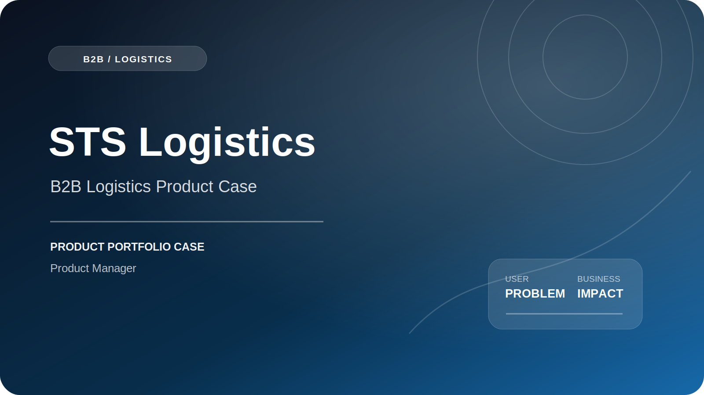

# STS Logistics — B2B Logistics Product Case

   

**Формализация B2B-сценариев личного кабинета: заявки, статусы, клиентская информация и история взаимодействий.**

[Официальный продукт](https://stslog.com/)

## Контекст продукта

STS Logistics — B2B-продукт логистической компании. Цифровой сценарий должен связывать выбор услуги, передачу исходных данных, обработку заявки, изменение статуса и коммуникацию с клиентом.

## Проблема пользователя и бизнеса

- клиенту нужно передать данные без повторных уточнений;
- видеть статус заявки и понимать следующий шаг;
- сохранять историю взаимодействий и контекст;
- для бизнеса — снижать ручную нагрузку и риск потери обращений.

## Моя роль

1. Собирал и уточнял требования заказчика.
2. Описывал пользовательские сценарии B2B-личного кабинета.
3. Формализовал логику создания и обработки заявок.
4. Прорабатывал статусы, клиентскую информацию и историю взаимодействий.
5. Готовил User Stories, Acceptance Criteria и технические задания.
6. Управлял backlog, приоритетами, зависимостями и scope.
7. Координировал заказчика, разработку и QA до релиза изменений.

## Основной пользовательский путь

`Выбор услуги → Передача данных → Создание заявки → Проверка / уточнение → Статус → Результат`

## Продуктовый фокус

| Область | Проблема / риск | Решение или критерий качества |
|---|---|---|
| Форма заявки | Неструктурированные обращения | Единая модель обязательных данных |
| Статусы | Клиент не понимает, что происходит | Понятная статусная модель и следующий шаг |
| История | Теряется контекст коммуникации | Единая хронология действий и сообщений |
| Качество требований | Переделки после разработки | Раннее согласование сценариев и AC |

## Результат и impact

Запросы заказчика и сложные B2B-сценарии были переведены в структурированный backlog с понятными статусами, зависимостями и критериями готовности. Процессные улучшения по портфелю Cetera: документация и User Stories **−40% времени**, обработка запросов **−30%**, переделки **−50%**.

## Metric framework

**North Star:** доля B2B-заявок, успешно обработанных через цифровой сценарий без потери контекста.

**Воронка:**  
`Service view → Request start → Request submitted → Accepted → Completed`

**Ключевые метрики:**

- request completion rate;
- self-service rate;
- time to first status;
- среднее время обработки заявки;
- доля заявок, требующих повторного ввода данных;
- support contacts per request;
- SLA обновления статуса.

**Guardrails:**

- ошибки форм;
- некорректные статусы;
- дубли заявок;
- потеря истории;
- инциденты с клиентскими данными.

## Артефакты Product Manager

- карта B2B-сценариев;
- статусная модель заявки;
- User Stories и Acceptance Criteria;
- функциональные требования;
- backlog и приоритизация;
- реестр рисков и зависимостей;
- release / QA checklist.

## Ограничения публикации

Репозиторий является портфолио-кейсом. Он не содержит production-код, внутренние документы, доступы, персональные данные, коммерческую аналитику или материалы, защищённые NDA. Официальный продукт и торговые марки принадлежат их владельцам; моя зона ответственности ограничена описанным выше scope.

## Компетенции

`B2B Product Management` · `Logistics` · `Personal Account` · `Requirements Analysis` · `Backlog` · `Stakeholder Management` · `Delivery`
